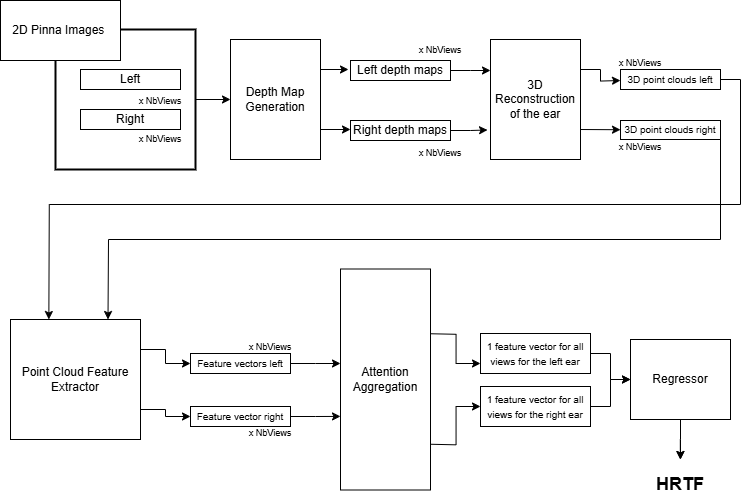

# Individualized HRTF Prediction from Multiview 2D Ear Images

This repository contains the code and resources for predicting individualized Head-Related Transfer Functions (HRTFs) from multiview 2D images of the ear. This project was developed as part of the **Munich Tech Arena 2024** organized by **Huawei**, where it secured the **3rd prize**.

The repository includes scripts for training, inference, and evaluation, as well as utility functions and datasets.

This project was developped by Anas EZZAKRI & Houda GHALLAB, two final year engineering students at IMT Atlantique, France.

Below is the pipeline of the proposed solution:


---

## Table of Contents
1. [Installation](#installation)
2. [Usage](#usage)
3. [Repository Structure](#repository-structure)
4. [References](#references)

---

## Installation

To get started, install the necessary dependencies listed in `requirements.txt`:

```bash
cd HRTF-prediction-from-multiview-2D-pinna-images
```
```bash
pip install -r requirements.txt
```

Next, follow the instructions provided in the official DepthAnything-V2 repository to set up the depth estimation model.

## Usage
The model can take either 3, 7 or 19 images per ear per individual, and produce a sofa file where the HRTF prediction results are stored.

To run the HRTF prediction model, run the file inference.py and execute the following script:

```
python3 inference.py -l IMAGE_PATH [IMAGE_PATH ...] -r IMAGE_PATH [IMAGE_PATH ...] -o SOFA_PATH
```

Example:
```
python3 inference.py -l ./data/SONICOM_TestData_pics/P0002_left_0.png ./data/SONICOM_TestData_pics/P0002_left_1.png -r ./data/SONICOM_TestData_pics/P0002_right_0.png ./data/SONICOM_TestData_pics/P0002_right_1.png -o ./data/output/prediction.sofa
```

he required options `-l` and `-r` are followed by one or more file paths of left and right pinna images, respectively. The required option `-o` is followed by a single path for the SOFA HRTF output file.
## Repository Structure
.
├── checkpoints/               # Pre-trained model checkpoints
│   ├── depth_anything_v2_vitl.pth
│   ├── HRTFNet.pth
│   └── mean_hrtf.pt
├── data/                      # Data processing scripts and exploratory analysis
│   ├── ear_extraction.py
│   └── EDA.ipynb
├── model/                     # Model definitions and utilities
│   ├── 3DHRTF.py
│   ├── HRTFNet_onefreq.py
│   ├── models.py
│   └── depth_anything_v2/     # DepthAnything-V2 model files
├── scripts/                   # Main scripts for training and inference
│   ├── inference.py
│   ├── test.py
│   └── training.ipynb
├── test_data/                 # Sample test images for inference
├── utils/                     # Utility functions and metrics
│   ├── metrics.py
│   ├── pointNet_utils.py
│   └── utils_d.py
├── .gitignore
├── README.md
├── requirements.txt
├── test_output.sofa
├── tree.txt
└── __init__.py

Important files are:
-> 3DHRTF.py: model to predict HRTF from 3D scans: Feature extractor + regressor.
-> HRTFNet_onefreq.py: main model to predict HRTF from 2D images.
-> inference.py: pipeline to test the model.
-> test.py: test for the inference file.
-> training.ipynb: training notebook for models.


## References
